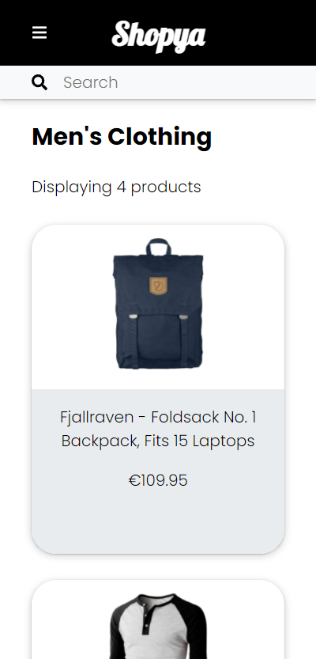
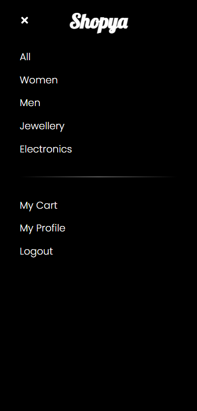
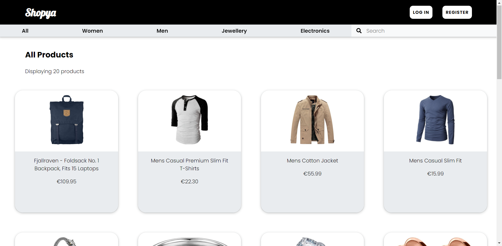
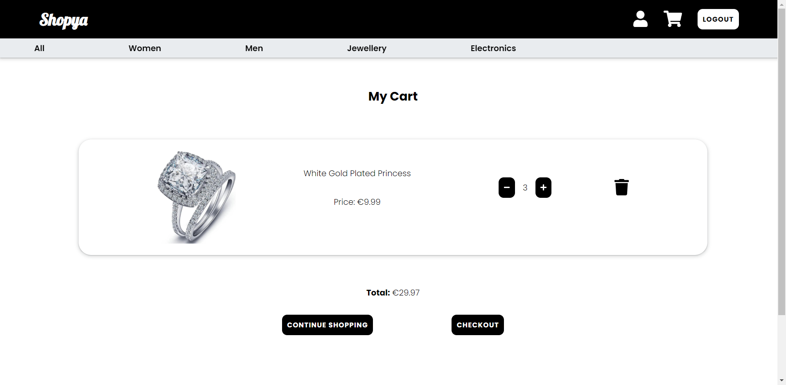

# E-commerce Front End [*Work in progress*]

The front end of an e-commerce website developed using:

- React
- SCSS
- API: [FakeStoreApi](https://fakestoreapi.com/)

https://hanjika.github.io/E-commerce/

*Note: Registration is not possible with the API*

## Objectives

- Create mockups for your app (Mobile & Desktop)
- Build a view to list all the products
- Build a view to display a single product
- Build a cart system
- Build a user profile view

## Login Details

Existing login details for testing:

| Username | Password |
|----------|----------|
| johnd    | m38rmF$  |
| mor_2314 | 83r5^_   |

## Previews

### Mobile

&nbsp;

&nbsp; 
 

### Desktop

