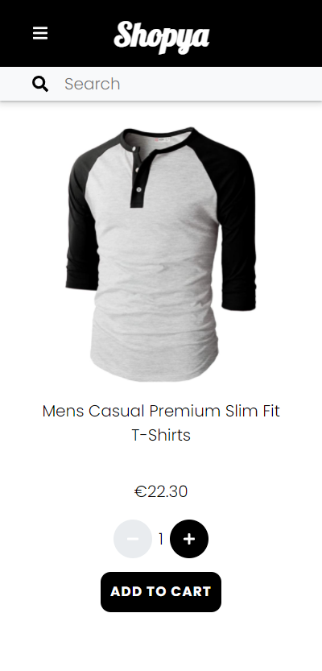

# E-commerce Front End

The front end of an e-commerce website developed using:

- React
- SCSS

https://hanjika.github.io/E-commerce/

## Objectives

- Create mockups for your app (Mobile & Desktop)
- Build a view to list all the products
- Build a view to display a single product
- Build a cart system
- Build a user profile view

## Login Details

Existing login details for testing:

| Username | Password |
|----------|----------|
| johnd    | m38rmF$  |
| mor_2314 | 83r5^_   |

## Previews

### Mobile

### Desktop

